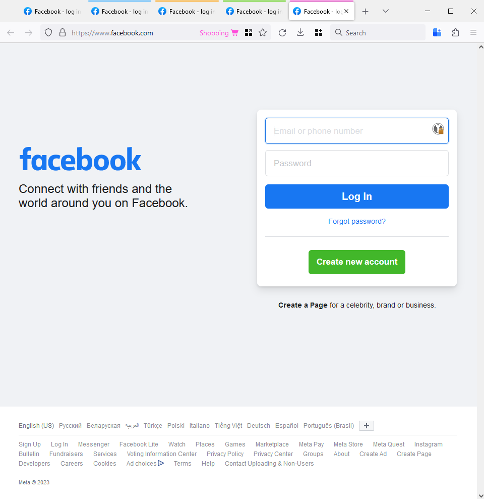
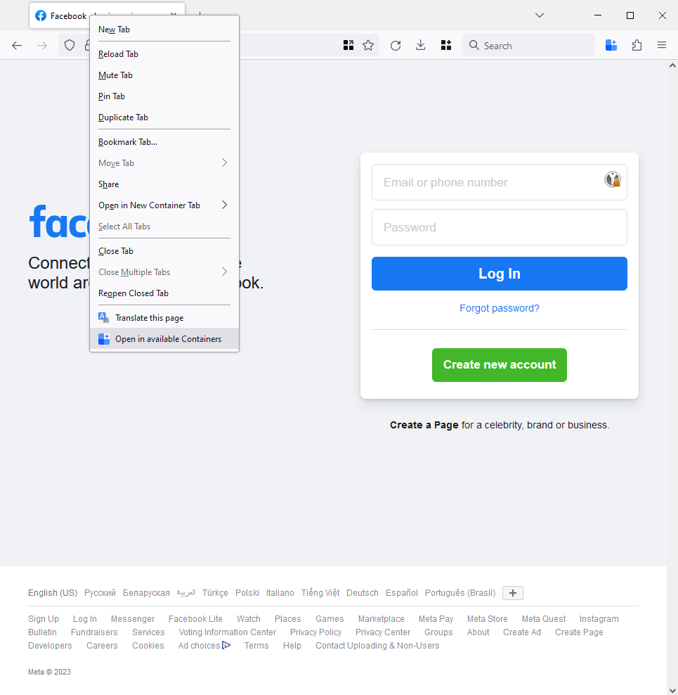

# Linky

### Introduction

Linky - Firefox add-on that simplifies browsing performing redundant tasks in
multiple containers. With Linky, you can easily open the current tab's URL in
all available containers with just one click.

Containers are a powerful feature of Firefox that enable you to separate your
online activity into different contexts, allowing you to manage your privacy,
security, and productivity more effectively. However, it can be tedious to
manually copy and paste URLs between containers when you want to switch
contexts.

Linky eliminates this hassle by providing a convenient button in the Firefox
toolbar that allows you to quickly open the current tab's URL in other available
containers. This means that you can effortlessly switch between different
contexts and continue browsing with ease.

With Linky, you can take full advantage of the powerful container feature in
Firefox and enhance your browsing experience.

### How to use

#### Run extension by click on extension icon

Click on extension icon


You can see the result of working web extension


#### Run extension by click on Context menu of Active tab

Call context menu on active tab URL, and click -> 'Open site into containers'


You can see the result of working web extension


### Deploying the extension

You can test the extension in FF by following these steps:

Download the code from Github

```sh
git clone https://github.com/Scandltd/linky.git
cd linky
```

```sh
npm install
```

Run in the root folder extension the command

```sh
npm start
```
